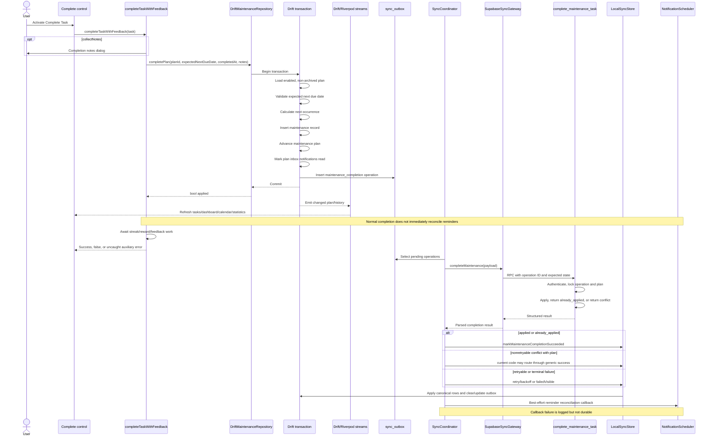

# Complete Task Remediation Plan

> **Historical implementation record:** The status below applies to the named historical baseline and audit only. This file is not a current runbook or release-validation artifact; executable Flutter, synchronization, migration, and test sources remain authoritative.

**Status:** Completed; all implementation, RPC migration, Flutter state, operation journaling, notification inbox reconciliation, and automated test validations are fully executed and verified.  
**Repository:** `zuhak5/HomePilot`  
**Baseline branch:** `main`  
**Baseline commit:** `e7d532ec8cf4cb6e64b11ca8b79777d3f63dff1f`  
**Primary source:** Completed Complete Task bug audit covering findings `CT-001` through `CT-010` and risks `R-001` through `R-003`.  
**Required destination:** `docs/plans/complete-task-remediation-plan.md`

> This plan follows `AGENTS.md`, `CONTRIBUTING.md`, and `docs/governance/documentation-maintenance.md`. Existing Supabase migrations are treated as append-only production history. Production credentials, linked production databases, signing, release, deployment, and other protected operations are outside this plan.

## 1. Executive summary

The Complete Task workflow has a sound local atomic-write foundation, but its cross-device reconciliation, causal ordering, durable reminder repair, and UI orchestration need correction. The remediation strategy is to preserve the current offline-first transaction and RPC idempotency model while making completion outcomes explicit and exhaustive at every layer.

This plan addresses **10 confirmed bugs**:

- `CT-001` plan-only cloud conflicts are incorrectly acknowledged as success.
- `CT-002` a device losing a concurrent completion cannot adopt the winning record.
- `CT-003` queued completions for one plan can be pushed out of causal order.
- `CT-004` normal local completion does not immediately reconcile reminders.
- `CT-005` reminder reconciliation failure after cloud success is not durable.
- `CT-006` terminal failure dismissal can silently preserve local/cloud divergence.
- `CT-007` failed notification-inbox completion is marked read.
- `CT-008` auxiliary post-commit failures can make a committed completion appear failed.
- `CT-009` completion single-flight state is local to some widgets rather than shared by plan.
- `CT-010` client/server clock validation differences can reject an already-committed local completion.

It also defines explicit verification and conditional implementation work for **3 high-confidence unresolved risks**:

- `R-001` the RPC may accept an invalid client-computed next due date.
- `R-002` monthly/yearly recurrence may drift away from an intended end-of-month anchor.
- `R-003` partial platform-notification failure may leave the OS alarm set inconsistent with the persisted snapshot.

The principal affected subsystems are:

1. Flutter completion entry points and Riverpod state.
2. `DriftMaintenanceRepository.completePlan` and local operational schema.
3. `LocalSyncStore` completion reconciliation and outbox ordering.
4. `SyncCoordinator` result classification, retry, and authentication handling.
5. `SupabaseSyncGateway` completion result parsing.
6. The `complete_maintenance_task` PostgreSQL RPC and its database tests.
7. Notification scheduling, snapshots, and restart recovery.
8. Recurrence/time handling, observability, localization, accessibility, and documentation.

The highest-risk data-integrity failures are silent deletion of a completion outbox entry when the cloud did not accept the local record, retention of a losing duplicate record after another device wins, and pushing dependent recurring completions in the wrong order. These must be resolved before UI polish.

Recommended implementation order:

1. Add failing characterization and regression tests.
2. Introduce typed local and remote completion outcomes.
3. Correct conflict reconciliation and causal queue ordering.
4. Add durable reminder-reconciliation work.
5. Introduce a plan-keyed Riverpod single-flight controller and migrate all entry points.
6. Harden authentication, terminal failure, and user recovery behavior.
7. Add the append-only RPC migration for canonical time handling and, if verified, canonical recurrence validation.
8. Complete recurrence, notification partial-failure, localization, accessibility, documentation, and full regression validation.

## 2. Scope

### 2.1 Included confirmed bugs

All confirmed audit findings `CT-001` through `CT-010` are in scope. Each appears in the traceability matrix and has implementation steps and regression coverage.

### 2.2 Included unresolved risks

`R-001`, `R-002`, and `R-003` are in scope as verification-gated work. The implementation agent must not silently convert them into confirmed defects. Each verification task must record its evidence and choose the applicable branch documented in this plan.

### 2.3 Explicit exclusions

- No production Supabase migration application.
- No use of production credentials, production data, service-role credentials, or linked destructive commands.
- No Android signing, release publication, public deployment, Sentry release mutation, or protected workflow execution.
- No unrelated refactor of the monolithic `lib/main.dart` beyond extraction required to centralize completion orchestration.
- No replacement of Riverpod, Drift, GoRouter, Supabase, or the existing outbox protocol.
- No destructive rewrite of existing migrations or historical test fixtures.
- No product-level recurrence semantic change without resolving `R-002` through documented evidence or human review.
- No change to points/rewards authority. Completion-related reward UI remains auxiliary and cannot control task persistence.

### 2.4 Assumptions

- The current branch remains based on the audited commit or any intervening changes are re-audited before implementation.
- The existing `completePlan` transaction remains the authoritative local mutation boundary.
- The completion operation ID remains the local maintenance-record ID and RPC idempotency key for an applied or exact-retry result.
- The current RPC locking and owner/device authorization are preserved unless a focused SQL test proves a defect.
- Drift streams remain the primary source for tasks, dashboard, statistics, calendar, history, and counters.
- Realtime events remain invalidation signals and do not directly apply unvalidated payloads.

### 2.5 Environmental and tooling constraints

Implementation requires Flutter `3.44.7` or the CI-pinned version, Dart code generation, a local Supabase stack, and at least one Android emulator or device for notification, keyboard, and accessibility validation. SQL concurrency verification requires two independent database sessions. DST tests require a controllable clock/time-zone abstraction and must not depend on the workstation’s current zone.

## 3. Current workflow map

### 3.1 Current entry points

The implementation agent must re-run a repository-wide search for `completeTaskWithFeedback`, `completePlan(`, `onComplete`, and the localized Complete Task labels before editing. The audited entry points are:

- Home dashboard `TaskCard` completion action.
- `MaintenanceScreen` / `TaskGroup` `TaskCard` actions.
- `CalendarScreen` selected-day `TaskCard` actions.
- Task search result completion controls.
- Task-detail `PremiumBottomActionBar` completion button.
- Notification inbox `NotificationCard` Complete action.
- Legacy/generic `TaskTile` trailing completion `IconButton`.

Task-card completion has a widget-local duplicate-tap guard. The detail, inbox, and legacy tile paths do not share that state. Swipe actions found in the audited task and calendar rows archive/move to Trash rather than complete a task.

### 3.2 Current end-to-end sequence



### 3.3 Current local transaction boundary

`DriftMaintenanceRepository.completePlan` currently performs the following in one Drift transaction:

1. Select the non-archived, enabled maintenance plan.
2. Reject a missing/inactive plan.
3. Reject a stale `expectedNextDueDate`.
4. Compute `completedAt` and the next occurrence.
5. Generate the completion/operation identifier.
6. Insert the maintenance record.
7. Advance `maintenance_plans.next_due_date` and update metadata/revision fields.
8. Mark associated inbox notifications read.
9. Remove a conflicting generic plan outbox mutation where required.
10. Insert the composite `maintenance_completion` outbox operation.

This boundary is correct and must be preserved. OS notification calls cannot join a SQLite transaction; durable notification intent must therefore be recorded in that transaction and executed after commit.

### 3.4 Current synchronization behavior

- `SyncCoordinator` selects pending work, marks it in flight, calls `SupabaseSyncGateway.completeMaintenance`, classifies the result, then delegates local reconciliation to `LocalSyncStore`.
- `SupabaseSyncGateway` calls `complete_maintenance_task` with a stable operation/idempotency key and a bounded timeout.
- The final effective RPC is the version produced by `20260728145152_harden_maintenance_completion_idempotency.sql`; the later August 6 migration does not replace it.
- The RPC uses advisory locking and returns structured `applied`, `already_applied`, conflict, or invalid results.
- Pull/realtime processing can later fetch canonical plan/record changes, but realtime must remain only a wake-up signal.

### 3.5 Current derived-state refresh

Task lists, detail reads, calendar grouping, dashboard metrics, statistics, history, and counters are primarily Drift-stream backed. Normal local commits should refresh these views without broad manual invalidation. Streak and other non-Drift derived state are refreshed separately and currently participate incorrectly in the helper’s success future.

## 4. Target architecture

### 4.1 Authoritative transaction boundary

The authoritative local transaction remains `DriftMaintenanceRepository.completePlan`, expanded only to write durable notification-reconciliation intent and completion dependency metadata. It must atomically commit:

- maintenance-record insertion;
- maintenance-plan advancement;
- relevant inbox read state;
- completion outbox mutation;
- causal predecessor metadata for the completion chain; and
- a local notification-reconciliation request for the affected plan.

If any SQLite write fails, none of these changes commit.

### 4.2 Completion orchestration ownership

Create a focused Riverpod controller under the maintenance feature, proposed as:

- `lib/src/features/maintenance/presentation/task_completion_controller.dart`
- `taskCompletionControllerProvider(planId)`
- `TaskCompletionController`
- `TaskCompletionState`
- `TaskCompletionPhase`
- `TaskCompletionOutcome`

The controller owns plan-level single-flight state and local completion orchestration. UI-only work remains in `completeTaskWithFeedback` or a smaller presentation helper:

- collect optional notes;
- invoke the controller;
- display localized success/error/warning feedback;
- start animation/audio only after local commit;
- avoid using disposed contexts.

The controller must remain alive for the duration of an active operation even if all widgets navigate away. Navigation or widget disposal must not cancel a committed or in-progress SQLite transaction.

### 4.3 Typed local completion outcome

Replace the repository’s Boolean-only result at the orchestration boundary with a typed result. A minimal contract is:

```dart
enum LocalMaintenanceCompletionStatus {
  applied,
  planUnavailable,
  planInactive,
  occurrenceChanged,
}

class LocalMaintenanceCompletionResult {
  final LocalMaintenanceCompletionStatus status;
  final String? operationId;
  final DateTime? previousDueDate;
  final DateTime? nextDueDate;
}
```

The implementation may retain a backward-compatible Boolean wrapper temporarily for unrelated callers, but all Complete Task entry points must consume the typed result before the phase is complete. This prevents stale/inactive/missing cases from collapsing into the same misleading message.

### 4.4 Single-flight behavior

Single-flight is keyed by `planId` and begins **before** opening the notes dialog. Required phases:

- `idle`
- `collectingNotes`
- `committingLocal`
- `reconcilingReminder`
- `completed`
- `failed`

`tryBegin()` must be atomic within the provider. A second control for the same plan receives `alreadyInProgress` and does not open another dialog or call the repository. Controls for different plans remain independent.

### 4.5 Completion identifiers and retries

- Generate one UUIDv7 operation ID inside the local transaction.
- Use it as the local maintenance-record ID, outbox `recordKey`, and RPC idempotency key.
- Never generate a new operation ID for automatic retry.
- `applied` and exact `already_applied` acknowledgements must return the same record ID.
- `occurrence_completed_elsewhere` is a different result: the winning canonical record may have another ID and must use a dedicated reconciliation method.

### 4.6 Causal ordering

Add completion dependency metadata to the outbox payload, not a cloud schema requirement:

```json
{
  "version": 2,
  "operation_id": "...",
  "plan_id": "...",
  "expected_next_due_date": "...",
  "next_due_date": "...",
  "depends_on_operation_id": "... or null"
}
```

When enqueueing a completion, select the latest unresolved completion for the same plan and write its operation ID as the predecessor. `LocalSyncStore` must perform a stable topological ordering:

1. An operation with no unresolved predecessor is ready.
2. A dependent operation cannot push while its predecessor is pending, in flight, conflict recovery, or failed-visible.
3. Among ready operations from independent chains, retain the existing retry/created-time priority.
4. For version-1 queued operations without an explicit dependency, infer same-plan order from `expected_next_due_date`, then `createdAt`, then operation ID.
5. Detect malformed cycles and quarantine them as visible protocol failures; never guess an order.

This avoids a Drift schema change solely for ordering while remaining restart-safe and compatible with existing queued payloads.

### 4.7 Exhaustive cloud result state machine

`SyncCoordinator._pushMaintenanceCompletion` must use an exhaustive switch. No conflict may fall through to generic success.

| RPC result | Required local action |
| --- | --- |
| `applied` | Require canonical plan and record with matching operation ID; call `markMaintenanceCompletionSucceeded`. |
| `already_applied` | Same as applied; retry-safe reconciliation. |
| `occurrence_completed_elsewhere` | Require canonical plan and winning record; call `reconcileMaintenanceOccurrenceCompletedElsewhere`. |
| `plan_inactive` | Remove/revert the optimistic record where safe, apply canonical plan, enqueue reminder repair, resolve or expose conflict. |
| `occurrence_changed` / stale revision | Compensate optimistic completion against canonical state; preserve newer local work or block the dependent chain. |
| `operation_id_reused` | Never acknowledge; mark failed-visible with no automatic new ID. |
| retryable transport/serialization/database failure | Retain same operation ID and back off. |
| authentication expired/revoked | Return mutation to an auth-blocked pending state; require sign-in; do not terminally discard. |
| terminal invalid result without canonical state | Mark failed-visible with completion-specific Retry and Revert actions. |

### 4.8 Conflict reconciliation invariants

Add dedicated `LocalSyncStore` transaction methods:

- `markMaintenanceCompletionSucceeded(...)`
- `reconcileMaintenanceOccurrenceCompletedElsewhere(...)`
- `reconcileRejectedMaintenanceCompletion(...)`
- `revertFailedMaintenanceCompletion(...)`
- `markMaintenanceCompletionAuthBlocked(...)` or equivalent generic auth-blocked state transition

Each method must:

1. Load and validate the outbox payload version and operation identity.
2. Compare the current local plan/record with the operation’s optimistic postimage.
3. Avoid overwriting a newer unrelated local edit.
4. Remove only the losing/rejected optimistic record identified by the operation.
5. Upsert canonical record/plan data when supplied.
6. Update remote shadows/revisions/checkpoints consistently.
7. enqueue notification reconciliation in the same local transaction;
8. remove, retain, or transition the outbox row according to the explicit result;
9. handle dependent queued completions as a chain rather than isolated rows.

### 4.9 Permanent sync failure behavior

For `maintenance_completion`, generic `dismiss` is not a valid resolution while divergent local data remains. Supported actions become:

- **Retry:** reuse the same operation ID and payload.
- **Revert local completion:** transactionally remove the optimistic record, restore the safe preimage/canonical plan, enqueue reminder repair, and remove the failed operation.
- **Review conflict:** for cases with dependent operations or newer local edits that cannot be automatically reverted.

A generic “dismiss and delete outbox row” action remains available only for entities where doing so cannot silently orphan domain state.

### 4.10 Durable notification architecture

Add a local operational table, proposed as `notification_reconciliation_requests`, with no foreign key that would prevent cleanup after plan deletion:

- `scope_key` text primary key, normally `plan:<planId>` and optionally `global`;
- `plan_id` nullable text;
- `reason` text;
- `created_at` and `updated_at`;
- `attempts` integer;
- `next_attempt_at` nullable datetime;
- `last_error_code` nullable text;
- `last_error_message` nullable sanitized text;
- `requires_full_rebuild` boolean.

The completion transaction upserts the plan request. A `NotificationReconciliationService` drains requests immediately after commit and during bootstrap/resume/background notification maintenance. On success it deletes the request. On failure it persists bounded retry metadata. Platform calls remain idempotent.

### 4.11 UI refresh and auxiliary work

- Local success is established when the Drift transaction commits, not when streak, animation, ad, reward, or notification-platform work finishes.
- Streak refresh and other auxiliary work execute independently and catch/report their own failures.
- A pending durable reminder repair may produce a nonblocking localized warning but cannot change an applied completion into failure.
- Drift-backed views update from streams. Only non-Drift caches/providers are invalidated explicitly.

## 5. Bug-to-fix traceability matrix

| Audit ID | Severity | Status | Root cause | Proposed fix | Likely files | Migration | Required tests | Dependencies | Risk | Completion criteria |
| --- | --- | --- | --- | --- | --- | --- | --- | --- | --- | --- |
| CT-001 | Critical | Confirmed | Nonretryable plan-only conflicts are routed through acknowledgement/success, deleting the outbox while retaining an unaccepted optimistic record. | Exhaustive result switch; add rejected-completion compensation transaction; remove generic-success fallback. | `sync_coordinator.dart`, `local_sync_store.dart`, `sync_dtos.dart`, `supabase_sync_gateway.dart` | No cloud migration required; local queue migration participates in reminder repair. | Coordinator plan-only conflict test; store rollback/canonical-plan test; dependent-chain test. | Typed result state machine. | High | No plan-only conflict can clear the operation without removing/reconciling the optimistic record. |
| CT-002 | High | Confirmed | Success reconciliation requires canonical record ID to equal the losing local operation ID. | Dedicated `occurrence_completed_elsewhere` reconciliation that deletes loser, adopts winner, applies plan, and resolves outbox. | `sync_coordinator.dart`, `local_sync_store.dart`, `sync_dtos.dart` | None | Two-device loser test; one-record invariant; retry after local apply failure. | CT-001 state machine. | High | Losing device ends with exactly the canonical winning record and plan. |
| CT-003 | High | Confirmed | Queue ordering relies on mutable wall-clock `changedAt` rather than causal plan order. | Add payload v2 predecessor; stable topological ordering; v1 fallback inference; block dependents after predecessor failure. | `repositories.dart`, `local_sync_store.dart`, `sync_dtos.dart`, tests | No schema migration required for payload-only dependency; revisit if implementation cannot query unresolved predecessor transactionally. | Clock rollback, equal timestamp, 3-operation chain, failed predecessor. | Typed payload parser. | High | Same-plan completions always push in recurrence order independent of clock changes. |
| CT-004 | High | Confirmed | Normal completion does not invoke local reminder cancellation/rescheduling. | Upsert durable reminder request inside completion transaction and drain immediately after commit. | `repositories.dart`, `app_database.dart`, `notification_service.dart`, controller/providers | Drift schema increment and migration. | Offline completion reminder replacement; app termination before scheduler call. | Durable reminder queue. | High | Old reminder is removed and next reminder scheduled offline or request remains visibly pending. |
| CT-005 | High | Confirmed | Cloud-success reminder callback failure is logged and forgotten. | Enqueue reminder request in every canonical reconciliation transaction; drain independently; retain retry state after failure/restart. | `local_sync_store.dart`, `sync_coordinator.dart`, `notification_service.dart`, `app_database.dart` | Same Drift migration as CT-004. | Throw-once scheduler; restart recovery; completion not resent. | CT-004 queue. | High | Reminder failure cannot be lost when completion outbox is cleared. |
| CT-006 | High | Confirmed | Generic terminal/dismiss behavior deletes operation evidence but leaves optimistic plan/history. Authentication failures also risk terminal classification. | Completion-specific Retry/Revert/Review actions; disallow dismiss; auth-blocked pending state; transactionally revert when chosen. | `local_sync_store.dart`, `sync_coordinator.dart`, diagnostics UI in `main.dart`, `sync_contracts.dart` | Possibly local enum/state migration only if state string contract cannot be extended without schema change. | Dismiss rejection, revert transaction, auth expiry, permanent invalid result, dependent chain. | CT-001 compensation and payload preimage. | High | No failed completion can disappear while unexplained divergent data remains. |
| CT-007 | Medium | Confirmed | Inbox handler ignores completion result and unconditionally calls `markRead`. | Remove redundant unconditional read or gate on applied result; rely on repository transaction for plan notification read state. | `main.dart`, widget tests | None | Failed/missing/disabled/stale notification completion remains unread. | Typed UI outcome. | Low | Inbox read/completed state changes only after successful local commit. |
| CT-008 | Medium | Confirmed | Awaited post-commit streak/reward/ad work can throw after persistence. | Establish immutable commit boundary; isolate auxiliary futures and sanitized logging; return applied result regardless. | new controller, `main.dart`, streak/monetization integration | None | Throwing streak/reward/audio service; one record; success returned. | Controller extraction. | Medium | No auxiliary exception changes a committed completion into a failed UI result. |
| CT-009 | Medium | Confirmed | Duplicate guard is widget-local and absent on several controls; notes dialogs can race. | Plan-keyed Riverpod single-flight beginning before notes collection; all controls watch shared state. | new controller file, `main.dart`, `components.dart`, provider wiring | None | Cross-surface simultaneous activation; keyboard/screen reader double activation; different-plan parallelism. | Typed result/controller. | Medium | One plan has at most one active completion interaction across the app. |
| CT-010 | Medium | Confirmed | Local device time can be accepted locally and rejected by stricter RPC future-time validation. | Inject testable clock; preserve offline commit; append-only RPC migration canonicalizes gross future timestamps and returns canonical record/time; reconcile locally. | `repositories.dart`, new clock service or existing clock seam, gateway/DTOs, RPC migration | New append-only Supabase migration; no signature removal. | +10-minute clock, timeout/retry, timestamp-adjusted response, stats reconciliation. | RPC migration and canonical response handling. | Medium | Clock skew does not permanently reject a valid user completion; canonical time is deterministic. |
| R-001 | High | Suspected | RPC may accept arbitrary client-computed next due date. | Verification task; if confirmed, add canonical server recurrence calculation or strict validation using an explicit plan timezone. | `recurrence_engine.dart`, data model, RPC migration, SQL tests | Conditional cloud/local schema migration if timezone/anchor data is needed. | Malicious far-future next due; parity corpus between Dart and SQL. | Timezone semantic decision. | High | Risk is either disproved by executable validation or fixed with server-authoritative recurrence. |
| R-002 | Medium | Suspected | Chained month/year clamping may lose original end-of-month anchor. | Characterization tests and product decision; preserve current semantics unless anchor behavior is documented; add anchor metadata only if approved. | `recurrence_engine.dart`, models/schema/RPC conditionally, docs | Conditional Drift/Supabase migration. | Jan 31 chains, leap/non-leap, yearly chains, existing-row compatibility. | Human/product decision if docs are silent. | Medium | Recurrence semantics are documented, deterministic, and tested across chains. |
| R-003 | Medium | Suspected | OS scheduling can partially mutate before snapshot commit. | Inject failure at each platform operation; add dirty/full-rebuild marker and idempotent stable IDs if inconsistency is reproduced. | `notification_service.dart`, local queue/snapshot schema, tests | Included in local reminder queue migration if marker is required. | Nth-operation failure, restart full rebuild, duplicate prevention. | CT-004 queue. | Medium | Partial failure either proven safe or repaired deterministically on next drain. |

## 6. Implementation phases

### Phase 1 — Reproduction harness and contract characterization

**Goal:** Lock current failures and safe invariants before changing behavior.

**Bugs:** All; primary focus `CT-001`, `CT-002`, `CT-003`, `CT-004`, `CT-005`, `CT-006`, `CT-007`, `CT-008`, `CT-009`, `CT-010`.

**Files/components:**

- `test/sync_coordinator_test.dart`
- `test/sync_store_test.dart`
- `test/home_structure_repository_test.dart`
- `test/widget_test.dart`
- `test/failed_mutation_diagnostics_test.dart`
- proposed `test/task_completion_controller_test.dart`
- proposed `test/notification_service_test.dart` if no focused file exists
- `supabase/tests/database/0011_complete_maintenance_task.test.sql`

**Implementation steps:**

1. Add deterministic fixture helpers for plan, record, operation payload v1/v2, canonical plan, canonical winner, fake clock, controlled UUID, fake gateway, and throw-on-Nth scheduler.
2. Add failing tests for CT-001 and CT-002 before editing coordinator/store code.
3. Add a queue-ordering test that uses a later completion with an earlier `changedAt`.
4. Add widget tests proving inbox false-result read behavior and simultaneous cross-surface activation.
5. Add post-commit auxiliary exception tests.
6. Add local future-clock and RPC future-time tests.
7. Preserve tests for the safe local transaction and exact RPC retry.
8. Mark `R-001` through `R-003` tests as characterization/verification, not asserted bugs until the experiment establishes the current result.

**Preconditions:** Current tests compile; no behavior changes yet.

**Dependencies:** None.

**Tests to add first:** The tests listed above must fail for the intended reason, not because of fixture or unrelated setup errors.

**Tests after implementation:** Re-run the same focused set in every later phase.

**Expected behavior:** Existing defects are reproducible and each test has one clearly named invariant.

**Rollback/recovery:** Test-only changes can be reverted independently; do not weaken existing expectations merely to match implementation.

**Exit criteria:** Every confirmed bug has at least one failing automated test or a precise device/SQL reproduction when automation is impossible.

### Phase 2 — Typed local outcome and plan-keyed completion controller

**Goal:** Establish one completion orchestration contract for every UI entry point.

**Bugs:** `CT-007`, `CT-008`, `CT-009`; prerequisite for other fixes.

**Files/components:**

- `lib/src/core/domain/contracts.dart`
- `lib/src/core/data/repositories.dart`
- new `lib/src/features/maintenance/presentation/task_completion_controller.dart`
- `lib/src/core/sync/sync_providers.dart` or the nearest maintenance provider file
- `lib/main.dart`
- `lib/src/ui/components.dart`

**Exact steps:**

1. Define `LocalMaintenanceCompletionStatus` and `LocalMaintenanceCompletionResult` in the domain contract layer or a focused maintenance model file.
2. Change `MaintenanceRepository.completePlan` to return the typed result. If minimizing immediate churn requires a transition, add `completePlanResult` and deprecate the Boolean method, then remove the wrapper in the same remediation series.
3. In `DriftMaintenanceRepository.completePlan`, distinguish missing, inactive, and expected-due mismatch without changing the transaction boundary.
4. Add `TaskCompletionController` as a Riverpod family keyed by plan ID.
5. Set `collectingNotes` before the dialog opens; cancellation returns to idle without a repository call.
6. Keep the provider alive during active work and release it only after completion/failure has been observed.
7. Move repository invocation and immediate reminder-drain request into the controller.
8. Treat local transaction commit as immutable success. Run streak/reward/feedback side effects through individually guarded futures.
9. Return a typed `TaskCompletionOutcome` to presentation code.
10. Retain `context.mounted` checks only around UI work; do not use widget lifecycle to cancel domain work.

**Preconditions:** Phase 1 tests exist.

**Dependencies:** None beyond current repository/providers.

**Tests to add first:** `task_completion_controller_test.dart` for same-plan single-flight, different-plan parallelism, cancellation, disposal, and auxiliary exceptions.

**Tests after implementation:** Controller tests, repository completion tests, existing `TaskCard` tests.

**Expected behavior:** Every caller sees the same in-flight state and a committed completion cannot become a logical failure because an auxiliary service throws.

**Rollback/recovery:** Controller extraction can be reverted without schema changes. Keep commits separated from later database work.

**Exit criteria:** One controller owns all completion calls; no direct UI caller invokes `maintenanceRepository.completePlan` outside approved tests/services.

### Phase 3 — Local durable intent and causal ordering

**Goal:** Preserve local atomicity while adding durable notification work and same-plan completion dependencies.

**Bugs:** `CT-003`, `CT-004`; foundation for `CT-005` and `CT-006`.

**Files/components:**

- `lib/src/core/database/app_database.dart`
- generated `lib/src/core/database/app_database.g.dart`
- `lib/src/core/data/repositories.dart`
- `lib/src/core/sync/local_sync_store.dart`
- backup/restore schema inventories and tests

**Exact steps:**

1. Add `NotificationReconciliationRequests` table using the fields in section 4.10.
2. Increment the Drift schema version.
3. Add migration logic from the immediately previous schema version; existing databases start with an empty reconciliation queue.
4. Review backup/restore behavior. Operational requests should normally be excluded and reconstructed from plans/snapshots after restore; encode and test that decision.
5. In `completePlan`, identify the latest unresolved same-plan completion and write `depends_on_operation_id` in payload version 2.
6. In the same transaction, upsert the plan’s notification-reconciliation request.
7. Add a typed payload parser that accepts v1 and v2. Reject malformed payloads safely.
8. Implement stable topological ordering for pending maintenance completions.
9. Prevent a dependent operation from pushing while its predecessor is unresolved or failed-visible.
10. Add cycle/malformed-chain detection and sanitized diagnostics.

**Preconditions:** Typed local outcome available.

**Dependencies:** Code generation tooling.

**Tests to add first:** Drift migration test, transaction rollback test, clock rollback ordering test, equal timestamp ordering test, predecessor failure test, payload-v1 compatibility test.

**Tests after implementation:** `dart run build_runner build`; focused repository/store/migration tests.

**Expected behavior:** App termination after local commit cannot lose reminder work or causal dependency information.

**Rollback/recovery:** A Drift schema migration is not reversible in place. Rollback is an application rollback that leaves the additive table harmless. Do not delete the table in a downgrade path.

**Exit criteria:** Local completion atomically creates record, advances plan, enqueues cloud operation, records predecessor, and enqueues reminder reconciliation.

### Phase 4 — Exhaustive sync result handling and canonical reconciliation

**Goal:** Correct every completion-result branch and preserve one canonical record per occurrence.

**Bugs:** `CT-001`, `CT-002`, part of `CT-006`.

**Files/components:**

- `lib/src/core/sync/sync_dtos.dart`
- `lib/src/core/sync/sync_contracts.dart`
- `lib/src/core/sync/supabase_sync_gateway.dart`
- `lib/src/core/sync/sync_coordinator.dart`
- `lib/src/core/sync/local_sync_store.dart`

**Exact steps:**

1. Model RPC statuses/reasons as closed enums or sealed result classes rather than free-form strings where practical.
2. Make gateway parsing fail closed on unknown combinations; retain the raw technical reason only in sanitized diagnostics.
3. Replace `_pushMaintenanceCompletion` conflict fallthrough with the exhaustive table in section 4.7.
4. Strengthen `markMaintenanceCompletionSucceeded` to accept only `applied`/exact `already_applied` with matching operation ID.
5. Implement `reconcileMaintenanceOccurrenceCompletedElsewhere`:
   - load loser operation;
   - delete only loser local record;
   - upsert winning canonical record;
   - apply canonical plan without overwriting newer unrelated local fields;
   - update shadows/revisions;
   - enqueue reminder request;
   - resolve loser outbox row;
   - inspect dependents and leave them runnable only if their expected state still matches canonical post-state.
6. Implement `reconcileRejectedMaintenanceCompletion` for plan-only conflicts:
   - remove optimistic record;
   - apply canonical plan or safe preimage;
   - enqueue reminder request;
   - resolve as compensated conflict or retain failed-visible when newer local/dependent work prevents safe automatic compensation.
7. Ensure all reconciliation changes occur in one Drift transaction.
8. On local reconciliation failure after cloud success, retain/requeue the operation. A retry must call the same operation ID and receive `already_applied` or the same deterministic conflict.

**Preconditions:** Payload parser and causal dependencies implemented.

**Dependencies:** Phase 3.

**Tests to add first:** Plan-only conflict compensation, concurrent winner adoption, dependent-chain canonical-match/mismatch cases, local apply failure then exact retry.

**Tests after implementation:** Coordinator and store suites; no SQL change required for these branches.

**Expected behavior:** No conflict is represented as generic success. Every device converges on one canonical record and plan or exposes a recoverable visible conflict.

**Rollback/recovery:** Keep old methods until new tests pass, then remove dead generic branch in a separate commit for review clarity.

**Exit criteria:** CT-001 and CT-002 regression tests pass and the previous incorrect test expectation is replaced rather than duplicated.

### Phase 5 — Authentication and permanent-failure recovery

**Goal:** Keep user work durable through session expiry and prevent silent dismissal of divergent completion state.

**Bugs:** `CT-006`.

**Files/components:**

- `lib/src/core/sync/sync_coordinator.dart`
- `lib/src/core/sync/local_sync_store.dart`
- `lib/src/core/supabase/supabase_failure.dart` if classification needs refinement
- failed-mutation diagnostics UI in `lib/main.dart`
- `test/failed_mutation_diagnostics_test.dart`

**Exact steps:**

1. Route authentication failures to a pending/auth-blocked state rather than terminal `failedVisible`.
2. Stop automatic retries until a valid session exists, but retain operation ID, payload, predecessor, and attempt diagnostics.
3. On reauthentication with the same account, reset auth-blocked completion operations to eligible pending and resume in causal order.
4. For terminal invalid completion results, expose completion-specific supported actions: Retry, Revert local completion, Review conflict.
5. Disallow generic Dismiss for `maintenance_completion` while its optimistic record or plan postimage remains.
6. Implement `revertFailedMaintenanceCompletion` transactionally using payload preimage/postimage validation. If newer local work exists, return `requiresReview` rather than overwriting it.
7. Ensure dependents remain blocked or are reverted as a chain according to explicit user choice.
8. Update diagnostics export to include only safe technical fields: result category, payload version, dependency depth, attempts, and sanitized reason. Do not include task title, notes, plan ID, record ID, user ID, or raw payload.

**Preconditions:** Compensation methods exist.

**Dependencies:** Phase 4.

**Tests to add first:** Auth expiration with queued completion, reauthentication resume, terminal rejection Retry, Revert, prohibited Dismiss, newer-local-edit requires review.

**Tests after implementation:** Failure diagnostics and account/sync coordinator suites.

**Expected behavior:** Authentication loss pauses rather than discards work; a permanent rejection is visible and recoverable.

**Rollback/recovery:** Existing generic states remain readable. If a new state string is added, implement tolerant parsing for older rows.

**Exit criteria:** No code path can delete a failed completion outbox entry without also reconciling or explicitly retaining its domain effect.

### Phase 6 — Durable notification reconciliation and partial-failure hardening

**Goal:** Make reminders converge with local/canonical task state offline, after cloud reconciliation, and after restart.

**Bugs:** `CT-004`, `CT-005`; verification/fix `R-003`.

**Files/components:**

- `lib/src/core/services/notification_service.dart`
- notification provider/bootstrap wiring
- `lib/src/core/database/app_database.dart`
- `lib/src/core/data/repositories.dart`
- `lib/src/core/sync/local_sync_store.dart`
- `lib/src/core/sync/sync_coordinator.dart`

**Exact steps:**

1. Add `NotificationReconciliationService` to read eligible local requests.
2. For a plan request, cancel stale plan reminders and run schedule reconciliation against current Drift state.
3. Delete the request only after the full platform operation and snapshot update succeed.
4. On failure, increment attempts, set bounded exponential backoff with jitter, persist a sanitized code, and retain the request.
5. Trigger draining:
   - immediately after successful local completion;
   - after completion sync reconciliation;
   - at app startup;
   - on app resume/time-zone change;
   - after notification permission/settings changes;
   - in existing background notification maintenance where supported.
6. Keep notification failure independent from cloud completion retry. A failed reminder operation must never resend an already-acknowledged completion.
7. Verify `R-003` by injecting failures before, during, and after each platform cancel/schedule step.
8. If partial OS state can diverge from the snapshot, set `requires_full_rebuild` before applying platform changes. On retry/startup, perform a conservative idempotent rebuild using stable notification IDs, then replace the snapshot and clear the dirty marker.
9. Surface a user-safe warning only when repair remains pending beyond the immediate attempt; avoid repeated toast spam.

**Preconditions:** Local queue table and controller integration exist.

**Dependencies:** Phases 3 and 4.

**Tests to add first:** Offline immediate reconciliation, process interruption, throw-once, partial failure at Nth operation, restart, duplicate alarm prevention, permission denial.

**Tests after implementation:** Notification unit/service tests, controller tests, Android device/emulator smoke tests.

**Expected behavior:** Reminder state is eventually correct and repair intent survives process death.

**Rollback/recovery:** Additive queue data remains safe if an older app ignores it. A downgrade may leave stale requests but must not corrupt plans/history.

**Exit criteria:** CT-004 and CT-005 tests pass; R-003 is either disproved with deterministic tests or fixed with dirty/full-rebuild behavior.

### Phase 7 — Migrate every UI entry point

**Goal:** Give every Complete Task control consistent loading, success, failure, notes, and accessibility behavior.

**Bugs:** `CT-007`, `CT-008`, `CT-009`.

**Files/components:**

- `lib/main.dart`
- `lib/src/ui/components.dart`
- localization ARB source files under `lib/l10n/`
- generated localization output through `flutter gen-l10n`

**Exact steps:**

1. Re-run entry-point search and produce a checked list in the implementation PR.
2. Make `completeTaskWithFeedback` delegate exclusively to `TaskCompletionController`.
3. Bind TaskCard visual animation/loading to shared provider state. Retain any local animation state only as presentation, not concurrency authority.
4. Disable task-detail completion while `collectingNotes`, `committingLocal`, or `reconcilingReminder` is active.
5. Disable inbox Complete and show progress semantics while active.
6. Disable legacy `TaskTile` completion and replace bare async `onPressed` with controller state.
7. Apply the same behavior to dashboard, task lists, calendar, and search.
8. In the inbox handler, remove the unconditional `markRead`; rely on transaction success or explicitly gate by `TaskCompletionOutcome.applied`.
9. Show success immediately after local commit. If reminder repair is pending, show a separate nonblocking localized warning.
10. Map local statuses to distinct localized messages: unavailable/inactive, occurrence changed, already in progress, local database failure, and permanent sync recovery state.
11. Ensure hardware Enter/Space and screen-reader activation cannot invoke a second action while disabled.
12. Preserve minimum touch target sizes, focus order, text scaling, Arabic RTL, and semantics labels.

**Preconditions:** Controller and typed outcomes complete.

**Dependencies:** Phases 2 and 6.

**Tests to add first:** One widget test per unguarded surface; English/Arabic; semantics and keyboard; navigation/disposal.

**Tests after implementation:** Focused widget suite and full `test/widget_test.dart`.

**Expected behavior:** Every Complete Task surface behaves as one coherent feature.

**Rollback/recovery:** UI migration can be split by surface, but do not leave any direct repository caller after the phase exits.

**Exit criteria:** Repository search confirms all entry points use the shared controller and all UI tests pass.

### Phase 8 — Canonical time and RPC hardening

**Goal:** Eliminate future-clock rejection of valid local work and determine whether next-due calculation must become server-authoritative.

**Bugs:** `CT-010`; verification/fix `R-001`.

**Files/components:**

- proposed clock abstraction under `lib/src/core/utils/` or existing time seam
- `lib/src/core/data/repositories.dart`
- `lib/src/core/sync/supabase_sync_gateway.dart`
- `lib/src/core/sync/sync_dtos.dart`
- new `supabase/migrations/20260807000000_harden_complete_maintenance_task_canonical_time.sql`
- `supabase/tests/database/0011_complete_maintenance_task.test.sql`

**Exact steps:**

1. Inject a testable clock into the maintenance repository/controller. Store local timestamps in UTC and convert only for display.
2. Preserve offline completion; do not require a network time request.
3. Add an append-only migration that replaces `complete_maintenance_task` while preserving its callable signature for older clients.
4. Preserve authentication, ownership, `SECURITY DEFINER` search path, advisory locks, operation-ID idempotency, and existing conflict codes.
5. For a `p_completed_at` more than the allowed future tolerance, use a canonical server timestamp rather than permanently rejecting the operation. Return the canonical record and an optional additive `timestamp_adjusted` flag.
6. Keep exact retries deterministic: retrying the same operation returns the already-created canonical record and the same adjusted timestamp.
7. Reconcile local history/statistics/plan state to the returned canonical record.
8. Execute the `R-001` verification:
   - send a valid expected state with a far-future client `next_due_date`;
   - inspect current RPC result and resulting plan;
   - compare against documented recurrence authority and time-zone data.
9. If R-001 is confirmed and the server has sufficient canonical timezone/anchor data, compute the next due date in SQL and ignore/validate the client proposal.
10. If canonical timezone data is absent, do not duplicate ambiguous recurrence logic. Add the minimum backward-compatible timezone/anchor representation first, or retain client calculation with strict bounded validation and record the limitation for human review.
11. Add owner success, anonymous denial, cross-user denial, exact retry, timeout-equivalent retry, future-clock adjustment, operation-ID reuse, and stale-state tests.

**Preconditions:** Client understands additive response fields and canonical record reconciliation.

**Dependencies:** Phase 4.

**Tests to add first:** SQL future timestamp case and gateway parsing test.

**Tests after implementation:** Supabase lint/tests and Flutter sync tests.

**Expected behavior:** A user completion made with a skewed device clock converges to a canonical server timestamp without duplicate history.

**Rollback/recovery:** Database migration rollback is a new forward migration; never edit historical migrations. Signature compatibility permits older clients to continue calling the RPC.

**Exit criteria:** CT-010 passes end to end; R-001 is documented as disproved, fixed, or blocked by an explicit human decision.

### Phase 9 — Recurrence semantics, localization, accessibility, and documentation

**Goal:** Resolve remaining semantic risk and synchronize documentation with behavior.

**Bugs/risks:** `R-002`, all user-visible changes.

**Files/components:**

- `lib/src/core/services/recurrence_engine.dart`
- recurrence models/schema conditionally
- `lib/l10n/app_en.arb`, `lib/l10n/app_ar.arb`
- documentation listed in section 17
- `CHANGELOG.md`

**Exact steps:**

1. Add chained monthly/yearly characterization tests before changing recurrence code.
2. Search product and architecture docs for explicit anchor semantics.
3. If current interval-from-last-due behavior is intended, document it and retain it.
4. If end-of-month/calendar-anchor behavior is required, add explicit recurrence anchor metadata, migration/backfill rules, server parity, backup handling, and tests. Do not infer user intent from one clamped date after migration.
5. Test daily/weekly/monthly/yearly recurrence across time zones and DST transitions using fixed zones and fake clocks.
6. Add English and Arabic strings for new loading, conflict, reminder-pending, Retry, Revert, and Review states.
7. Verify RTL layout, focus order, semantics, keyboard activation, and screen-reader announcements.
8. Update documentation in the same commits as the behavior described.

**Preconditions:** Core completion behavior stable.

**Dependencies:** Phases 6 through 8.

**Tests to add first:** Recurrence chain matrix and localization key-presence tests.

**Tests after implementation:** `flutter gen-l10n`, recurrence, widget, semantics, and golden tests where appropriate.

**Expected behavior:** Recurrence and user-facing recovery behavior are explicit, localized, and accessible.

**Rollback/recovery:** If recurrence product semantics remain unresolved, do not ship a schema/behavior change. Keep only characterization tests and a clearly labeled decision blocker.

**Exit criteria:** R-002 has a documented resolution or human-review blocker; localization and accessibility acceptance checks pass.

### Phase 10 — Full regression and release-readiness validation

**Goal:** Prove the complete workflow across local, sync, SQL, notification, and UI layers.

**Bugs:** All.

**Files/components:** Entire affected test and documentation set.

**Exact steps:**

1. Run focused tests first, then the repository-standard Flutter suite.
2. Run local Supabase lint and database tests.
3. Run Android emulator/device integration tests for offline completion, restart, notification repair, keyboard, TalkBack, English, and Arabic.
4. Run two-session SQL concurrency tests.
5. Inspect generated Drift and localization changes; do not hand-edit them.
6. Inspect final diff for unrelated changes, secrets, raw user content in logs, stale tests, or modified historical migrations.
7. Record commands executed, results, and protected/device/hosted checks not executed.
8. Prepare PR documentation-impact statement and changelog entry.

**Preconditions:** All implementation phases complete.

**Dependencies:** All prior phases.

**Expected behavior:** Every completion scenario has deterministic final local/cloud/reminder/UI state.

**Rollback/recovery:** Keep changes in reviewable commits by phase. Database rollback requires a forward migration; local additive schema is retained safely if application code is rolled back.

**Exit criteria:** Definition of done in section 19 is satisfied.

## 7. File-by-file change plan

| File path | Relevant symbols | Current responsibility | Planned modification | Why here | Validating tests | Documentation impact |
| --- | --- | --- | --- | --- | --- | --- |
| `lib/main.dart` | `completeTaskWithFeedback`, task-detail Complete callback, `MaintenanceScreen._completeTask`, `CalendarScreen`, notification completion handler, `TaskTile`, search/dashboard callers, failed-mutation actions | UI composition and current completion helper | Delegate to shared controller; remove direct repository calls; remove unconditional inbox `markRead`; bind loading/errors/recovery actions; isolate UI feedback. | Existing entry points live here; keep only presentation concerns after extraction. | `test/widget_test.dart`, integration flow test | Product feature behavior, localization/RTL docs. |
| `lib/src/ui/components.dart` | `TaskCard`, `PremiumBottomActionBar`, `NotificationCard` if defined here | Shared controls and TaskCard local animation/guard | Accept shared busy/phase state; expose correct disabled semantics; retain animation without being concurrency authority. | Shared widgets must render one consistent state across screens. | Widget/semantics/keyboard tests | Localization/RTL and accessibility notes. |
| `lib/src/features/maintenance/presentation/task_completion_controller.dart` (new) | `taskCompletionControllerProvider`, `TaskCompletionController`, `TaskCompletionState`, `TaskCompletionOutcome` | None | Central plan-keyed single-flight and local orchestration; commit boundary; guarded auxiliary work; reminder drain trigger. | Removes business orchestration from widgets and provides cross-surface state. | New controller tests | System overview and sync workflow docs. |
| `lib/src/core/domain/contracts.dart` | `MaintenanceRepository.completePlan`, `NotificationScheduler` contract | Domain interfaces | Return typed local completion result; add targeted notification reconciliation contract if needed. | Domain behavior should not be represented by ambiguous Boolean results. | Repository/controller fakes and contract tests | Data model/system overview. |
| `lib/src/core/data/repositories.dart` | `DriftMaintenanceRepository.completePlan` | Atomic local maintenance mutation | Preserve transaction; return typed result; add payload v2 predecessor; enqueue notification request; use injected clock. | This is the authoritative local transaction boundary. | `home_structure_repository_test.dart`, migration/transaction tests | Data model, sync protocol, backup review. |
| `lib/src/core/database/app_database.dart` | `SyncOutbox`, reminder snapshots, schema version/migration | Drift schema | Add `NotificationReconciliationRequests`; increment schema; additive migration and indexes. | Durable local reminder repair is operational state. | Schema/migration/store tests | Data model and backup/restore docs. |
| `lib/src/core/database/app_database.g.dart` | Generated Drift code | Generated output | Regenerate only with build runner. | Required by source schema change; never edit manually. | Build/analyze/tests | None directly. |
| `lib/src/core/services/notification_service.dart` | scheduler initialization, `refreshSchedules`, `cancelPlanReminders`, `_applyScheduleDiff` | Desired-vs-platform reminder reconciliation | Add queue drain service or integrate focused worker; persist retry; verify/implement dirty full rebuild; ensure stable IDs and idempotent retries. | Platform notification behavior belongs in notification service layer. | Focused notification tests and device tests | Routes/permissions, privacy if behavior/logging changes. |
| `lib/src/core/services/recurrence_engine.dart` | next-occurrence calculation | Client recurrence authority | Add characterization tests; change only after R-002 decision; expose shared vectors for SQL parity if R-001 confirmed. | Central existing recurrence logic. | Recurrence unit tests | Data model/feature behavior/ADR if semantics change. |
| `lib/src/core/sync/sync_dtos.dart` | maintenance-completion payload/result DTOs | Serialized sync representations | Add payload version 2 dependency; closed result status/reason; additive timestamp-adjusted parsing. | DTO layer owns protocol shape. | Gateway/parser/store tests | Sync protocol/backend docs. |
| `lib/src/core/sync/sync_contracts.dart` | sync mutation/result/state contracts | Coordinator/store interfaces | Add explicit completion outcomes and auth-blocked/review state if needed. | Prevent stringly typed fallthrough. | Coordinator/store tests | Sync protocol. |
| `lib/src/core/sync/supabase_sync_gateway.dart` | `completeMaintenance` | RPC call and response parsing | Parse exhaustive result; preserve timeout/idempotency; accept additive canonical timestamp/next-due fields; fail closed on invalid shapes. | Gateway is the cloud protocol boundary. | Gateway fake/client tests and coordinator tests | Backend/sync protocol. |
| `lib/src/core/sync/sync_coordinator.dart` | `_pushMaintenanceCompletion`, `_recordMutationFailure`, `_reconcileMaintenanceCompletionReminders` | Push/retry/result dispatch | Exhaustive switch; completion-specific conflict calls; auth-blocked handling; reminder queue drain trigger without coupling completion retry. | Coordinator owns mutation lifecycle and retry classification. | `sync_coordinator_test.dart` | Sync protocol and testing docs. |
| `lib/src/core/sync/local_sync_store.dart` | `pendingMutations`, `markMaintenanceCompletionSucceeded`, conflict/failure resolution | Durable outbox, local canonical reconciliation | Topological ordering; winner/rejection/revert transactions; dependency blocking; enqueue reminder work; prohibit unsafe dismissal. | Store owns transactionally consistent local sync metadata/domain reconciliation. | `sync_store_test.dart`, failed diagnostics tests | Data model/sync protocol. |
| `lib/src/core/sync/sync_providers.dart` | coordinator/provider wiring | Dependency construction | Provide controller dependencies and notification reconciler service; ensure bootstrap/resume drain registration. | Riverpod composition root for sync services. | Provider/controller tests | System overview. |
| `lib/src/core/supabase/supabase_failure.dart` | `SupabaseFailure.from` | Failure classification | Adjust only if session-expiry/auth errors cannot be distinguished reliably; preserve safe messages. | Central technical classification should feed coordinator policy. | Failure mapping tests | Auth/sync docs if behavior changes. |
| `lib/l10n/app_en.arb` | New completion state/recovery strings | English source localization | Add loading, conflict, retry, revert, review, reminder-pending, auth-required strings. | User-visible text source of truth. | Localization/widget tests | Localization docs. |
| `lib/l10n/app_ar.arb` | Corresponding Arabic messages | Arabic source localization | Add reviewed Arabic translations and placeholder metadata. | Required parity and RTL behavior. | Arabic widget/semantics tests | Localization docs. |
| `test/task_completion_controller_test.dart` (new) | Controller unit/provider tests | None | Deterministic single-flight, cancellation, auxiliary failure, reminder pending, disposal. | Faster than widget-only coverage for state machine. | Self | Testing docs. |
| `test/home_structure_repository_test.dart` | Existing maintenance repository tests | Drift/domain repository coverage | Add atomic queue/predecessor/result/clock tests. | Existing repository test location. | Self | None. |
| `test/sync_store_test.dart` | Store/reconciliation/order tests | Local sync store coverage | Add topological ordering, compensation, winner adoption, dependent-chain, v1 compatibility. | Existing store test location. | Self | Testing docs. |
| `test/sync_coordinator_test.dart` | Coordinator/fake gateway tests | Result/retry orchestration | Replace incorrect plan-conflict success expectation; add all result branches/auth/local-apply retry. | Existing coordinator test location. | Self | Testing docs. |
| `test/failed_mutation_diagnostics_test.dart` | `resolveFailedMutation` tests | Diagnostics and recovery | Seed domain rows; assert unsafe dismiss prohibited and revert repairs domain/reminders. | Existing tests currently inspect only outbox rows. | Self | Sync/operations docs. |
| `test/widget_test.dart` | TaskCard, inbox, screens, semantics | Broad Flutter UI tests | Add all entry-point loading/success/failure/RTL/accessibility cases. | Existing comprehensive widget harness/fakes. | Self | Localization/testing docs. |
| `test/notification_service_test.dart` (new or existing focused file) | Scheduler diff/queue tests | Notification service | Add queue retry, partial failure, restart/full rebuild, stable-ID tests. | Keep platform-scheduler invariants isolated. | Self | Testing/notification docs. |
| `integration_test/complete_task_flow_test.dart` (new) | Cross-layer app journey | Integration coverage | Use local Drift/fakes or local Supabase profile for offline/restart/reconnect/cloud reconciliation. | Current integration coverage does not exercise completion sync. | Device/local-service run | Testing docs. |
| `supabase/migrations/20260807000000_harden_complete_maintenance_task_canonical_time.sql` (new) | `public.complete_maintenance_task` | Append-only RPC replacement | Canonicalize gross future time; preserve signature/locks/auth/idempotency; optionally add verified recurrence validation. | Cloud authority change requires forward migration. | `0011_complete_maintenance_task.test.sql` | Backend migration/sync docs. |
| `supabase/tests/database/0011_complete_maintenance_task.test.sql` | RPC pgTAP/SQL cases | Completion database contract | Add clock, exact retry, concurrent sessions or companion test, next-due attack, authorization. | Existing authoritative RPC test file. | `npm run supabase:test` | Testing/backend docs. |
| `docs/architecture/sync-protocol.md` | Maintenance completion/conflicts/retries | Sync contract | Document exhaustive result behavior, dependencies, recovery, auth blocking, reminder queue. | Behavior changes synchronization contract. | Manual path/link review | Required. |
| `docs/architecture/data-model.md` | Operational metadata/reminders | Conceptual data model | Document reminder reconciliation requests and completion dependency payload. | New durable local operational state. | Manual review | Required. |
| `docs/architecture/system-overview.md` | Major services/providers/data flow | Architecture overview | Add controller and notification-reconciliation service boundaries. | New durable orchestration components. | Manual review | Required. |
| `docs/backend/supabase.md` | RPC contract | Backend overview | Document canonical timestamp and result compatibility. | RPC behavior changes. | Manual/SQL source verification | Required if migration implemented. |
| `docs/backend/migrations-and-functions.md` | Migration history/rules | Backend operations | Add rollout/compatibility/recovery notes for new migration. | Append-only RPC change. | Manual review | Required. |
| `docs/development/testing.md` | Test matrices/commands | Testing guidance | Add completion-specific local/cloud/notification/concurrency matrix and device evidence. | New required regression layers. | Command verification | Required. |
| `docs/development/localization-and-rtl.md` | RTL/accessibility workflow | Localization | Add completion recovery state verification where useful; no duplicated mutable strings. | UI behavior changes. | Manual review | Review/update as needed. |
| `docs/product/feature-catalog.md` | User-visible task completion | Product behavior | Document offline completion, visible sync conflict/recovery, reminder pending behavior. | Material user-visible behavior. | Manual review | Required if wording currently omits behavior. |
| `docs/reference/routes-and-permissions.md` | Notifications/permissions | Permissions behavior | Review notification retry/rebuild claims; update only if operational behavior changes documented contract. | Notification system affected, no new permission intended. | Manual review | Review; update if needed. |
| `docs/architecture/backup-and-restore.md` | Operational table inclusion | Backup contract | State that reminder repair queue is reconstructed/excluded, or document inclusion if chosen. | New persistent table requires backup review. | Backup tests | Required. |
| `CHANGELOG.md` | Unreleased changes | Release notes | Add user-visible data-integrity, sync recovery, and reminder correctness entry. | Material behavior and migration change. | Manual review | Required. |

## 8. Database and migration plan

### 8.1 Local Drift migration

Increment `AppDatabase.schemaVersion` by one for `NotificationReconciliationRequests`. The migration must:

1. Create the table and indexes without modifying existing domain rows.
2. Use an empty queue for upgraded installations.
3. Preserve all existing `sync_outbox`, shadows, cursors, reminder snapshots, and account-binding data.
4. Add a migration test from the immediately previous schema version.
5. Test a database containing pending maintenance completions during upgrade.
6. Exclude the operational queue from user backup unless the backup architecture explicitly includes operational runtime state. After restore, enqueue a global notification rebuild instead.
7. Regenerate Drift output through `dart run build_runner build`.

No local schema change is required solely for completion dependency ordering if dependency data is stored in payload v2. If implementation constraints require indexed dependency queries, pause and document why an additive `depends_on_record_key` column is necessary before adding it.

### 8.2 Append-only Supabase migration

Create:

```text
supabase/migrations/20260807000000_harden_complete_maintenance_task_canonical_time.sql
```

Use a later unused timestamp if that path already exists when implementation begins.

The migration must replace the function definition forward. Do not edit:

- `20260728030000_complete_maintenance_task.sql`
- `20260728040000_fix_maintenance_completion_conflicts.sql`
- `20260728041000_fix_maintenance_completion_id_conflict.sql`
- `20260728042000_enable_maintenance_completion_rpc.sql`
- `20260728145152_harden_maintenance_completion_idempotency.sql`

### 8.3 RPC compatibility and signature

- Preserve the current function name and argument signature so queued requests from older clients remain callable.
- Preserve authenticated ownership derived from `auth.uid()` and validated device identity.
- Preserve safe `search_path`, `SECURITY DEFINER` review, advisory plan/operation locks, and grants.
- Preserve the operation ID as the idempotency key.
- Return additive JSON fields only. Older clients must be able to ignore them.
- Do not change an exact retry from success to conflict.

Proposed additive response fields:

- `canonical_completed_at`
- `timestamp_adjusted` boolean
- `canonical_next_due_date` when the server computes/validates recurrence
- existing canonical `plan` and `record`

### 8.4 Time validation

For a client completion timestamp beyond the accepted future tolerance:

1. Do not create a second operation.
2. Use a server canonical timestamp for the new record.
3. Return the canonical record and adjustment flag.
4. Ensure exact retries return the same record/time.
5. Retain the supplied client timestamp only if a separately reviewed column is added; do not add it merely for diagnostics.

### 8.5 Recurrence validation (`R-001` gate)

Before adding SQL recurrence logic, determine:

- whether `next_due_date` is UTC absolute time or local wall-clock schedule;
- where the authoritative time zone is stored;
- whether end-of-month anchoring is part of the contract;
- whether SQL and Dart can produce identical daily/weekly/monthly/yearly results.

Possible outcomes:

- **Confirmed and sufficient canonical data:** Add a stable SQL helper and compute the canonical next due date server-side. Add parity vectors shared with Dart tests.
- **Confirmed but missing timezone/anchor data:** Add backward-compatible plan fields through new Drift/Supabase migrations first; old clients continue passing next due but server applies bounded validation until adoption is complete.
- **Not confirmed:** Retain the current client proposal but keep explicit SQL tests proving the accepted bounds and update the audit disposition.

### 8.6 Locking and concurrency

Keep lock acquisition deterministic:

1. Lock/idempotency-check operation ID.
2. Lock the canonical plan/occurrence.
3. Re-read state under lock.
4. Return exact `already_applied` for the same operation.
5. Return `occurrence_completed_elsewhere` with the canonical winner for a different operation that completed the same occurrence.
6. Never create two accepted records for one canonical occurrence.

Add a genuine two-session test or test script; sequential calls are insufficient to prove blocking/race behavior.

### 8.7 Indexes and constraints

Do not add cloud indexes speculatively. Verify query plans for operation-ID lookup and same-occurrence detection. Add an index only when existing constraints/indexes do not support the lock/check path. Any uniqueness change must account for user ownership, soft deletion, and historical records.

### 8.8 Local Supabase verification commands

```powershell
npm ci
npx supabase start
npm run supabase:lint
npm run supabase:test
```

Use only the local stack and ports in `supabase/config.toml`.

### 8.9 Rollback limitations

Applied production migrations are not edited or removed. A defect in the new RPC must be corrected by a later forward migration restoring or replacing behavior. Client code must remain compatible with both the current and new additive response shape during rollout.

## 9. Local persistence plan

### 9.1 Transaction contents

After remediation, `completePlan` commits the following atomically:

1. Validate active plan and expected occurrence.
2. Calculate optimistic local completion and next due.
3. Insert one maintenance record with one operation ID.
4. Advance the plan.
5. Mark relevant inbox items read.
6. Insert version-2 completion outbox payload with preimage, optimistic postimage, and predecessor.
7. Upsert plan notification-reconciliation request.

OS notification calls, streak refresh, animation, rewards, and cloud calls occur after commit.

### 9.2 Failure rollback

Any error before transaction commit rolls back all domain and operational writes. The controller returns a pre-commit failure and no success animation/read state is shown.

### 9.3 Duplicate local prevention

Defense in depth:

- plan-keyed UI/controller single-flight;
- expected-next-due compare inside the transaction;
- SQLite write serialization;
- one generated operation ID reused through all retries;
- payload/preimage validation during reconciliation.

Do not depend on the UI guard for database integrity.

### 9.4 App termination

- **Before transaction commit:** no completion or outbox/reminder request persists.
- **After commit, before UI feedback:** completion, sync operation, and reminder request persist; streams recover on restart.
- **During reminder scheduling:** request remains until success; retry is idempotent.
- **During sync:** outbox state and lease recovery preserve operation; exact RPC retry is safe.
- **After cloud commit, before local reconciliation:** same operation retries and receives deterministic already-applied/canonical result.

### 9.5 Queue ordering

Use explicit dependency when present and deterministic inference for old payloads. A failed predecessor blocks dependents from automatic push. UI/diagnostics must show the chain as one conflict group rather than encouraging out-of-order individual retries.

### 9.6 Schema migration and backup tests

Add tests for:

- previous schema to new schema;
- pending outbox rows retained;
- reminder queue initially empty;
- a post-upgrade completion writes the queue;
- backup export excludes/reconstructs operational queue according to the documented decision;
- restore schedules a global rebuild.

## 10. Synchronization and conflict plan

| Scenario | Expected final local state | Expected final cloud state | Outbox/retry behavior | Reminder behavior |
| --- | --- | --- | --- | --- |
| Normal online completion | Optimistic record/plan immediately; then canonical values applied. | One canonical record; plan advanced. | Operation removed after applied acknowledgement. | Local request drained immediately; canonical reconciliation may enqueue idempotent recheck. |
| Completion while offline | Record and advanced plan visible; operation and reminder request durable. | Unchanged until reconnect. | Pending with same operation ID. | Local reminder state reconciles without network. |
| Automatic retry | Local optimistic state retained. | Eventually one canonical result. | Same ID/payload; bounded backoff. | Independent local retry queue. |
| Timeout before server receipt | Local optimistic state retained. | No operation yet. | Retry same ID; first accepted call applies. | Already locally reconciled. |
| Timeout after server commit | Local optimistic state retained until retry response. | One committed record. | Retry same ID returns `already_applied`; local canonical apply then removes outbox. | Canonical reconciliation request is idempotent. |
| Duplicate identical request | One local/canonical record. | One record. | `already_applied`; no new ID. | No duplicate alarms. |
| Two devices complete same occurrence | Winner record replaces loser on losing device; one record remains. | One winning record and canonical plan. | Loser operation resolves through dedicated winner-adoption path. | Both devices reconcile to canonical next due. |
| Stale due date / plan changed elsewhere | Optimistic record removed or operation moved to visible review if unsafe; canonical plan applied. | Remote state remains canonical. | Never generic success; compensated conflict or failed-visible review. | Rebuild/cancel based on canonical plan. |
| Out-of-order queued completions | Same-plan chain held in recurrence order. | Operations apply in causal order or later operation is blocked after predecessor conflict. | Topological ordering; no wall-clock-only ordering. | Each accepted/reverted occurrence queues plan reconciliation. |
| Permanent invalid operation | Local optimistic state retained only while user chooses Retry/Revert/Review. | No accepted record unless server returned canonical conflict data. | Failed-visible; Dismiss prohibited. | Request reflects current chosen local/canonical state. |
| Authentication expiration | Local state and operation retained. | No new mutation while unauthenticated. | Auth-blocked pending; resume with same account/session. | Local reminders continue; cloud reminder recheck waits. |
| Local success, cloud rejection | Automatic compensation when canonical data makes it safe; otherwise visible recoverable conflict. | Rejection/canonical state unchanged. | Operation resolved only with compensation or user recovery. | Reconcile after compensation. |
| Cloud success, local reconciliation failure | Local may remain optimistic temporarily. | Canonical success retained. | Keep/retry same operation; receive already-applied; never create duplicate. | Queue added only when local canonical transaction succeeds; retry later. |
| Realtime update during local completion | Pending local intent preserved; remote event triggers validated pull. | Canonical state determined by RPC/remote revisions. | Pull merge respects pending completion and shadows. | Reconcile after final local merge. |
| Existing v1 queued operation | Parsed with compatibility path; predecessor inferred. | Existing RPC request remains valid. | No payload rewrite required unless safely migrated locally. | Reconciliation request generated when operation is processed or during startup scan. |
| Operation ID reused with different payload | Local operation remains visible as protocol conflict. | Server rejects reuse; no second record. | No automatic new ID or silent deletion. | Keep current local reminder state until Retry/Revert/Review. |

### 10.1 Realtime and pull ordering

When a realtime signal arrives while a local completion is pending, pull processing must compare remote row, local row, shadow, and pending operation. It must not overwrite the optimistic record or plan merely because the remote row lacks the pending local change. After RPC resolution, a targeted pull may confirm canonical state.

### 10.2 Older app compatibility

- Keep RPC signature callable by old clients.
- Add response fields only.
- Accept payload v1 in the client store for already-queued local operations.
- New clients infer dependencies for v1 rows.
- Do not require the new reminder queue for cloud protocol compatibility; it is local operational repair.

## 11. UI and state-management plan

### 11.1 Shared state

Every surface reads `taskCompletionControllerProvider(planId)`. The provider exposes phase and optional outcome/error. It is the sole concurrency authority.

### 11.2 Loading indicators

- TaskCard: retain completion sweep/progress and disable action/menu conflicts.
- Task detail: replace active label/icon with localized progress; disable button.
- Inbox: show progress in the Complete action and disable it.
- Legacy TaskTile: show a compact progress indicator and disable the IconButton.
- Search/calendar/dashboard/tasks: receive the same state through their cards.

All busy controls expose `Semantics(enabled: false, liveRegion: ...)` appropriately and must not announce repeated success.

### 11.3 Success timing

Show success after the local transaction commits. Do not wait for cloud sync. A separate sync status can later show pending or failed cloud state. A reminder-pending warning is nonblocking and must not claim the task failed.

### 11.4 Error presentation

- Dialog cancellation: no error.
- Already in progress: no duplicate dialog; optionally focus/announce existing progress.
- Plan unavailable/inactive: localized specific message.
- Occurrence changed: localized message and refreshed current task state.
- Local database failure before commit: error; no success feedback.
- Permanent cloud failure: account/sync diagnostics expose Retry/Revert/Review; do not retroactively remove the original local success without a reconciliation event.
- Auth expiry: sign-in-required sync state; local completion remains.

### 11.5 Retry affordances

Core UI does not generate a new completion on retry. Sync Retry reuses the outbox operation. Failed-mutation UI shows operation-level Retry/Revert/Review. Revert must require confirmation explaining that local history and next due will be restored.

### 11.6 Navigation and disposal

- Notes-dialog cancellation resets provider state.
- Navigation away after commit does not cancel domain work.
- Toast/overlay code checks `context.mounted`.
- Provider stays alive during active work and stores final state long enough for another surface to observe it.
- No `setState` occurs after widget disposal.

### 11.7 Provider invalidation and derived views

Do not broadly invalidate Drift-backed providers merely to force refresh. Verify that these update from table streams:

- task lists and detail;
- dashboard summary/readiness;
- calendar grouping/counts;
- statistics and completion history;
- task counters and inbox state.

Explicitly refresh only non-Drift derived providers such as streak or cached reward state, and isolate their failures.

### 11.8 Entry-point acceptance checklist

For each audited entry point verify:

- uses shared controller;
- begins single-flight before notes collection;
- disabled/loading semantics are visible;
- cancellation works;
- success occurs after local commit;
- false/stale result does not show success or mark read;
- navigation/disposal is safe;
- English and Arabic labels fit;
- keyboard and screen-reader activation call once.

## 12. Recurrence and time-handling plan

### 12.1 Recurrence ownership

`RecurrenceEngine` remains the client source for optimistic offline calculations. The cloud must either compute the same canonical result or validate the proposal using enough canonical timezone/anchor data. Duplicating ambiguous recurrence logic in SQL is prohibited.

### 12.2 Canonical conventions

- Persist/transmit instants as UTC ISO-8601/timestamptz.
- Apply local time zone only for wall-clock recurrence construction and display.
- Inject `Clock`/time-zone dependencies into tests.
- Do not use device wall clock as the sole ordering source.
- Use operation dependency and server revision/time for synchronization ordering.

### 12.3 Required recurrence cases

- Daily interval across month/year boundaries.
- Weekly interval across DST and year boundaries.
- Monthly 28/29/30/31 cases.
- Chained January 31 behavior in leap and non-leap years.
- End-of-month anchor decision.
- Yearly February 29 to non-leap and back to leap years.
- Hourly recurrence through DST spring gap and fall overlap.
- Time-zone change after local completion but before sync.
- Completion before due, after due, and far overdue.

### 12.4 Device clock and future timestamps

- Local offline work is not blocked solely because network time is unavailable.
- A known large clock skew may show a warning but still records durable intent.
- The RPC returns canonical time instead of permanently rejecting gross future timestamps.
- Local reconciliation updates record timestamps/statistics to canonical values.
- Queue ordering never relies solely on `completedAt` or `changedAt`.

### 12.5 R-002 verification task

**Question:** Does “monthly” mean interval from the last effective due date, original day-of-month anchor, or end-of-month anchor?

**Files:** `recurrence_engine.dart`, maintenance plan model/schema, product/feature docs, existing recurrence tests.

**Experiment:** Add chained Jan 31 → Feb → Mar and Feb 29 → yearly-chain characterization tests; inspect documentation and UI recurrence wording.

**Outcomes:**

- If interval-from-last-due is intended, preserve March 28/29-type drift and document it.
- If original calendar anchor is intended, add explicit anchor day/end-of-month metadata and migrations.
- If evidence is conflicting or absent, stop before behavior/schema change and request product decision.

## 13. Notification consistency plan

### 13.1 Cancellation and scheduling order

After local transaction commit:

1. Read current desired schedule from Drift.
2. Cancel stale notification IDs for the affected plan.
3. Schedule the next occurrence/reminder set using stable IDs.
4. Persist the new snapshot only after the platform operation succeeds.
5. Delete the reconciliation request only after snapshot success.

The same worker handles canonical cloud reconciliation, plan disable/archive/delete, restore, settings changes, and timezone changes where appropriate.

### 13.2 Transaction relationship

Platform scheduling does not occur inside the Drift transaction. The transaction records durable intent. This is a transactional outbox pattern for local platform work:

```text
Domain transaction commits plan/history + notification request
                       ↓
Post-commit worker applies OS alarms idempotently
                       ↓
Worker deletes request only on full success
```

### 13.3 Failure and retry

- Persist attempts and next retry.
- Use bounded exponential backoff with jitter.
- Treat permission denial/channel disabled as blocked state rather than tight retry loop.
- Resume when permission/settings/lifecycle changes.
- Do not block cloud completion sync on notification repair.
- Do not delete request when only some platform operations succeeded.

### 13.4 Restart reconstruction

At startup:

1. Drain explicit pending requests.
2. Detect dirty/incomplete snapshot state.
3. If necessary enqueue `global` full rebuild.
4. Recompute desired schedules from current plans/settings.
5. Rebuild idempotently with stable IDs.

After backup restore, enqueue a global rebuild rather than restoring stale Android alarm handles.

### 13.5 Tests

Use a fake platform scheduler with a recorded operation log and configurable failure index. Test every interruption point and assert eventual exact equality between desired schedules, persisted snapshot, and fake OS state.

## 14. Test plan

| Scenario | Level | Proposed file | Setup | Action | Expected result | Bug IDs |
| --- | --- | --- | --- | --- | --- | --- |
| Normal single local completion | Drift repository | `test/home_structure_repository_test.dart` | Enabled plan, fixed clock/UUID | Complete once | One record, plan advanced, inbox read, outbox v2, reminder request in one commit | baseline |
| Local transaction rollback | Drift repository | same | Inject failure before final insert | Complete | No record/plan/outbox/reminder partial write | CT-004 |
| Disabled/archived/deleted plan | Drift repository | same | Inactive variants | Complete | Typed unavailable/inactive result; no writes | CT-007/009 |
| Stale expected due | Drift repository | same | Plan due changed | Complete stale task | `occurrenceChanged`; no writes | CT-009 |
| Same-plan controller double activation | Provider | `test/task_completion_controller_test.dart` | Completer-backed repository | Call twice | One notes/repository call; second gets in-progress | CT-009 |
| Two surfaces simultaneously | Widget/provider | `test/widget_test.dart` | Detail and inbox for same plan | Activate both before completion resolves | One operation; both show shared busy state | CT-009 |
| Different plans concurrently | Provider | controller test | Two plan IDs | Complete both | Two independent operations allowed | CT-009 |
| Dialog cancelled | Provider/widget | controller/widget tests | collectNotes enabled | Cancel | State returns idle; no repository call | CT-009 |
| Widget disposed/navigation | Widget | `test/widget_test.dart` | Delayed repository | Navigate away | Commit completes; no disposed-context exception | CT-008/009 |
| Post-commit streak throws | Provider | controller test | Repository applies; streak throws | Complete | Applied outcome, one record, sanitized auxiliary error | CT-008 |
| Post-commit reward/audio throws | Provider/widget | controller/widget tests | Throwing fake | Complete | Success remains; no uncaught exception | CT-008 |
| Inbox completion false | Widget | `test/widget_test.dart` | Repository returns stale/inactive | Tap Complete | Notification remains unread/actionable | CT-007 |
| TaskCard duplicate taps | Widget | existing widget test | Delayed operation | Rapid taps | One call; shared state still authoritative | CT-009 |
| Keyboard double activation | Widget semantics | `test/widget_test.dart` | Focus Complete control | Send Enter/Space repeatedly | One operation | CT-009 |
| Screen-reader semantics | Widget semantics | same | Semantics enabled | Invoke action twice | Disabled/busy state prevents second invocation | CT-009 |
| Arabic/RTL completion | Widget | same | Locale `ar` | Complete/fail/retry | Correct RTL, labels, focus, no overflow | CT-007/009 |
| Payload v2 predecessor | Drift/store | `test/home_structure_repository_test.dart` | Two offline occurrences | Complete twice | Second payload references first | CT-003 |
| Clock rollback ordering | Store | `test/sync_store_test.dart` | Later occurrence has earlier changedAt | Read pending | Earlier occurrence is pushed first | CT-003 |
| Equal timestamps | Store | same | Same changedAt | Read pending | Deterministic expected-due/ID order | CT-003 |
| Three-operation chain | Coordinator/store | store/coordinator tests | A→B→C | Sync | Calls A, then B, then C | CT-003 |
| Failed predecessor blocks child | Coordinator/store | same | A failedVisible, B depends A | Sync | B not sent; chain visible | CT-003/006 |
| v1 queued operations | Store | same | Old payloads without predecessor | Read pending | Order inferred safely | CT-003 |
| Plan-only conflict | Coordinator/store | coordinator/store tests | Optimistic record; gateway returns canonical plan/no record | Sync | Optimistic record removed or visible review; canonical plan applied; no generic success | CT-001 |
| Concurrent winner adoption | Coordinator/store | same | Local loser ID, remote winner ID | Sync | Loser deleted, winner upserted, exactly one record | CT-002 |
| Winner plus compatible dependent | Store | same | B depends losing A, canonical winner has same post-state | Reconcile | B remains pending and valid | CT-002/003 |
| Winner plus incompatible dependent | Store | same | Canonical post-state differs | Reconcile | Dependent chain blocked/review; no blind push | CT-001/002/003 |
| Cloud success/local apply failure | Coordinator | coordinator test | Store throws first apply | Sync twice | Same op retried; second already-applied reconciles; no duplicate | CT-002 |
| Authentication expiration | Coordinator | coordinator test | Auth failure during push | Sync | Operation auth-blocked/pending; no terminal deletion | CT-006 |
| Reauthentication | Coordinator | same | Restore same account session | Retry | Same operation resumes in order | CT-006 |
| Permanent rejection Retry | Store/UI | diagnostics tests | failedVisible completion | Retry | State pending, same ID | CT-006 |
| Permanent rejection Revert | Store/UI | diagnostics tests | optimistic record and preimage | Revert | Record removed, plan restored safely, reminder queued | CT-006 |
| Unsafe Dismiss | Store/UI | diagnostics tests | failed completion still divergent | Dismiss | Action rejected/not offered | CT-006 |
| Revert with newer local edit | Store | sync store test | Plan edited after completion | Revert | `requiresReview`; newer fields preserved | CT-006 |
| Offline reminder update | Notification/controller | notification/controller tests | Existing old alarm, offline | Complete | Old canceled/new scheduled locally | CT-004 |
| Termination before reminder drain | Drift/integration | integration test | Commit then recreate services | Restart | Pending request drains | CT-004 |
| Cloud reconciliation scheduler throws | Coordinator/notification | tests | Canonical apply succeeds; scheduler throws | Sync/restart | Completion not resent; reminder request persists and retries | CT-005 |
| Partial cancel failure | Notification | notification test | Fail Nth operation | Reconcile | Dirty request remains; later full rebuild exact | R-003 |
| Partial schedule failure | Notification | same | Fail Nth schedule | Reconcile/restart | No permanent duplicate/stale alarm | R-003 |
| Permission denied | Notification/widget | tests | Denied notifications | Drain | Blocked request/no retry spin; user-safe state | CT-004/005 |
| Future device clock | Repository/coordinator/SQL | repo/coordinator/SQL tests | Clock +10 minutes | Complete and sync | Local applies; server canonicalizes; local record updates | CT-010 |
| Timeout before receipt | Coordinator | coordinator test | Gateway timeout without server apply | Retry | Same ID eventually applied once | baseline/CT-010 |
| Timeout after commit | Coordinator/SQL | coordinator + SQL | Server applies then response lost | Retry | `already_applied`; one record | baseline |
| Far-future next due | SQL verification | `0011_complete_maintenance_task.test.sql` | Valid expected state, malicious next due | Call RPC | Reject/recompute according to R-001 decision | R-001 |
| Genuine concurrent sessions | SQL concurrency | companion SQL/script | Two sessions/IDs same occurrence | Execute concurrently | One applied, one canonical loser response, one record | CT-002 |
| Jan 31 chained monthly | Unit | recurrence test file | Fixed due Jan 31 | Calculate multiple cycles | Matches documented anchor semantics | R-002 |
| Leap-year yearly chain | Unit | recurrence test | Feb 29 | Multiple years | Deterministic documented results | R-002 |
| DST spring gap/fall overlap | Unit/service | recurrence/notification tests | Fixed IANA zones/fake clock | Complete/schedule | Documented wall-clock behavior; no duplicate/missing alarm | R-002/R-003 |
| Realtime during pending completion | Sync | coordinator/store test | Pending local op, remote invalidation | Pull + push | Local intent preserved; canonical resolution later | CT-001/003 |
| Dashboard/calendar/statistics refresh | Drift-backed widget/integration | widget/integration tests | Real in-memory Drift providers | Complete | All views/counters refresh without broad manual invalidation | CT-008/009 |

Deterministic seams required:

- injected `Clock`;
- controlled UUID generator;
- fake `SupabaseSyncGateway` with response/timeout sequencing;
- fake notification platform with failure index and persistent fake OS state;
- in-memory Drift database plus historical migration fixture;
- two-session local PostgreSQL test for actual concurrency;
- fixed IANA time zones rather than host-local time.

## 15. Validation commands

Run from the repository root in PowerShell unless the command is explicitly device-specific.

### 15.1 Dependency and generated source

```powershell
flutter pub get
flutter gen-l10n
dart run build_runner build
```

### 15.2 Focused Flutter tests during implementation

```powershell
flutter test --no-pub test/task_completion_controller_test.dart
flutter test --no-pub test/home_structure_repository_test.dart
flutter test --no-pub test/sync_store_test.dart
flutter test --no-pub test/sync_coordinator_test.dart
flutter test --no-pub test/failed_mutation_diagnostics_test.dart
flutter test --no-pub test/notification_service_test.dart
flutter test --no-pub test/widget_test.dart --plain-name "completion"
```

Adjust the final command to actual test names; do not use a filter that accidentally excludes required cases.

### 15.3 Formatting, analysis, and full Flutter suite

```powershell
dart format --output=none --set-exit-if-changed lib test integration_test
flutter analyze --no-pub
flutter test --no-pub --concurrency=1 --timeout 3m --exclude-tags production-config
```

### 15.4 Production configuration schema only

```powershell
flutter test --no-pub test/prod_build_config_test.dart `
  --dart-define-from-file=config/prod.example.json `
  --dart-define=VERIFY_PRODUCTION_CONFIG=true
```

This does not authorize or validate a signed production release.

### 15.5 Integration/device tests

```powershell
flutter test --no-pub integration_test/complete_task_flow_test.dart -d <device-id>
```

Run on an Android emulator/device configured for English and Arabic. Repeat relevant notification cases with notification permission granted, denied, and disabled. TalkBack and hardware-keyboard verification require device/manual evidence in addition to automated semantics tests.

### 15.6 Local Supabase

```powershell
npm ci
npx supabase start
npm run supabase:lint
npm run supabase:test
```

For focused SQL iteration, use the repository’s existing Supabase test script/filter mechanism if one exists; do not invent a production-linked command.

### 15.7 Documentation validation

No automated documentation checker is currently established as authoritative. Manually verify:

- every referenced path exists;
- commands match `AGENTS.md`, `CONTRIBUTING.md`, workflows, and package scripts;
- Mermaid renders;
- no planned behavior is written as already implemented;
- internal links and migration filenames are correct;
- documentation-impact statement lists reviewed and changed files.

## 16. Observability and diagnostics

### 16.1 Structured technical events

Add or refine privacy-safe events such as:

- `maintenance_completion_local_applied`
- `maintenance_completion_local_rejected`
- `maintenance_completion_sync_result`
- `maintenance_completion_conflict_compensated`
- `maintenance_completion_winner_adopted`
- `maintenance_completion_chain_blocked`
- `maintenance_completion_auth_blocked`
- `maintenance_completion_reverted`
- `maintenance_reminder_reconciliation_pending`
- `maintenance_reminder_reconciliation_recovered`

Allowed fields are stable technical categories only, for example:

- result/reason enum;
- payload version;
- retry attempt bucket;
- dependency depth/count;
- whether canonical plan/record was present;
- whether timestamp was adjusted;
- whether reminder repair requires full rebuild.

Do not log:

- task title, instructions, notes, asset/room names;
- raw plan, record, operation, user, or device identifiers;
- email/name/location;
- authentication tokens or raw JWT/session errors;
- raw RPC request/response payloads;
- notification body/content.

If correlation is required, use the existing privacy-reviewed operation fingerprint mechanism rather than a raw UUID.

### 16.2 Sentry breadcrumbs

Breadcrumbs may capture the technical phase transition and sanitized reason code. Screenshots, replay, view hierarchy, and raw HTTP bodies remain disabled. Auxiliary failures should be tagged as post-commit/nonblocking so they are not misinterpreted as data loss.

### 16.3 Error classification

Distinguish:

- local validation rejection;
- local database failure;
- retryable offline/timeout;
- authentication blocked;
- permission/ownership denied;
- protocol/schema incompatibility;
- canonical conflict compensated;
- canonical conflict requiring review;
- notification repair pending;
- auxiliary UI/service failure.

### 16.4 User-safe diagnostics

Failed-mutation diagnostics must show a localized description and supported action without exposing task content. Exported diagnostics retain only privacy-safe fields already used by the repository and add no raw payload.

## 17. Documentation updates

Documentation updates ship in the same phase as the corresponding behavior.

| Document | Required change |
| --- | --- |
| `docs/architecture/sync-protocol.md` | Document payload v2 dependencies, exhaustive completion outcomes, auth-blocked pending, winner adoption, compensation, permanent recovery, and independent reminder repair. |
| `docs/architecture/data-model.md` | Add notification reconciliation requests as operational metadata; document completion ID/dependency and backup implications. |
| `docs/architecture/system-overview.md` | Add task completion controller and notification reconciliation service boundaries/data flow. |
| `docs/backend/supabase.md` | Describe effective RPC behavior, canonical time, additive response compatibility, and recurrence authority if changed. |
| `docs/backend/migrations-and-functions.md` | Record the new forward migration, deployment ordering, compatibility, tests, and forward-only rollback. |
| `docs/development/testing.md` | Add completion concurrency, timeout, conflict, reminder, clock, RTL, accessibility, and device matrices. |
| `docs/development/localization-and-rtl.md` | Review/update completion dialog, warning, recovery, and semantics verification requirements. |
| `docs/product/feature-catalog.md` | Describe immediate offline completion, pending cloud recovery, and reminder consistency in user-facing terms. |
| `docs/reference/routes-and-permissions.md` | Review notification permission and restart-rebuild behavior; update if current statements become incomplete. No new permission is planned. |
| `docs/architecture/backup-and-restore.md` | Document exclusion/reconstruction of operational reminder requests and full rebuild after restore. |
| `README.md` | Review; update only if its high-level feature claims become inaccurate. Do not duplicate protocol detail. |
| `PRIVACY.md` | Review observability and notification changes. No change is expected if no new data or third party is introduced; record reviewed-no-change rationale. |
| `SECURITY.md` | Review RPC authorization/idempotency changes; update only if the security contract changes. |
| `CHANGELOG.md` | Add unreleased entries for data-integrity reconciliation, durable reminders, duplicate-action protection, and canonical clock handling. |
| proposed ADR | Create `docs/adr/0003-maintenance-completion-reconciliation.md` if the durable reminder queue, conflict compensation contract, or recurrence authority is considered costly to reverse. |

The implementation PR must state one of `Updated`, `Reviewed, no change`, or `Temporary exception` for every relevant document. A temporary exception requires explicit approval and a tracked follow-up.

## 18. Risk assessment

| Risk | Probability | Impact | Mitigation | Detection | Rollback/recovery |
| --- | --- | --- | --- | --- | --- |
| Automatic compensation deletes valid newer local work | Medium | Critical | Compare operation preimage/postimage and dependencies; require Review on mismatch. | Store tests with newer edits/dependents; diagnostic metrics. | Keep operation failed-visible; restore through forward fix, not blind overwrite. |
| Duplicate maintenance history during winner adoption | Medium | High | Delete only loser ID, upsert canonical winner, assert one-record invariant. | Two-device tests and DB counts. | Re-run canonical reconciliation; forward data repair if released. |
| Incorrect next-due date from SQL/client parity | Medium | High | R-001 verification, timezone/anchor contract, shared parity vectors. | SQL/Dart corpus and production-safe technical conflict rates. | Forward RPC migration; retain old signature. |
| Recurrence semantic change surprises existing users | Medium | High | Do not change R-002 without documented decision; explicit anchor fields/backfill. | Characterization tests and migration fixture review. | Preserve old semantics for existing rows or forward migration with compatibility mode. |
| Queued v1 operations cannot be ordered safely | Low/Medium | High | Infer by expected due; quarantine malformed/ambiguous chains. | Compatibility tests and visible protocol diagnostics. | User Review/Revert; do not send ambiguous child. |
| New outbox dependency cycle | Low | High | Generate predecessor transactionally; validate no self/cycle; topological detection. | Unit/store cycle test and sanitized event. | Block chain and require review. |
| Drift migration failure | Low | High | Additive table, previous-version fixture, generated code review. | Migration tests/startup test. | App rollback leaves additive table; later schema migration fixes issue. |
| RPC migration incompatibility with older clients | Low/Medium | Critical | Preserve signature and existing fields/statuses; additive response fields only. | Old-client SQL contract fixtures/gateway compatibility tests. | Forward migration restoring compatible function. |
| Reminder queue retries indefinitely under denied permission | Medium | Medium | Blocked reason and event-driven resume; bounded retry. | Queue-state tests and diagnostics count. | User setting/permission resolution; clear only after safe rebuild/disable decision. |
| Partial OS alarm mutation leaves stale snapshot | Medium until verified | High | R-003 failure injection; dirty/full rebuild; stable IDs. | Fake OS-state equality and device tests. | Global idempotent rebuild on startup. |
| UI loading state remains stuck | Low/Medium | Medium | Controller `finally`, keepAlive lifecycle tests, timeout only for auxiliary work. | Provider/widget tests and Sentry phase breadcrumb. | Provider reset/rebuild; domain operation remains durable. |
| Performance regression from topological ordering | Low | Medium | Limit to pending batch; parse once; group by plan; benchmark 200-row batch. | Unit benchmark/timing log in test only. | Optimize in-memory graph; no protocol rollback needed. |
| Excess notification rebuild battery use | Low/Medium | Medium | Coalesce requests by plan/global, backoff, lifecycle batching. | Fake call-count tests and device profiling. | Tune batching in app update. |
| Localization overflow or incorrect Arabic recovery text | Medium | Medium | Arabic review, narrow-width/text-scale tests, directional APIs. | Widget/golden/manual RTL review. | String/layout patch; no data impact. |
| Accessibility duplicate activation | Medium | Medium | Shared disabled semantics and single-flight before dialog. | Semantics/keyboard/TalkBack tests. | UI-only patch; DB guards still prevent duplicate records. |
| Privacy regression in diagnostics | Low | High | Allowlist fields; no raw payload/IDs/content; existing scrubber. | Unit tests asserting sensitive fixture text absent. | Remove field/event in immediate patch; Sentry privacy review. |

## 19. Definition of done

The remediation is complete only when all of the following are true:

- Every confirmed bug `CT-001` through `CT-010` has an implemented fix.
- Every fix has deterministic regression coverage at the appropriate layer.
- No duplicate completion is possible from repeated interaction, cross-surface activation, automatic retry, or timeout-after-commit.
- Local record creation, plan advancement, cloud outbox enqueueing, dependency metadata, and reminder-reconciliation intent cannot be partially committed.
- RPC retries remain idempotent and reuse the original operation ID.
- Concurrent-device behavior is deterministic: one canonical record, explicit loser adoption, and documented dependent-operation behavior.
- Plan-only conflicts cannot be acknowledged as success while an unaccepted local record remains.
- Permanent sync failures are visible and support Retry, Revert, or Review; unsafe Dismiss is impossible.
- Authentication expiration preserves queued work and resumes safely after same-account reauthentication.
- Same-plan offline completions are pushed in causal recurrence order independent of device-clock changes.
- Gross future clock skew converges to canonical server time rather than permanently rejecting valid local work.
- `R-001`, `R-002`, and `R-003` are each marked disproved, fixed, or blocked by a documented human decision with evidence.
- Daily, weekly, monthly, yearly, end-of-month, leap-year, timezone, DST, and clock-change tests pass according to documented semantics.
- Old reminders are canceled and new reminders scheduled after local and canonical completion.
- Notification failures remain durable, retry after restart, and cannot cause completion resubmission.
- Every Complete Task entry point uses the same plan-keyed controller and shows consistent loading/success/error behavior.
- Task lists, detail, calendar, dashboard, statistics, history, counters, and inbox state refresh correctly.
- English, Arabic, RTL, text scaling, keyboard, semantics, and screen-reader behavior are verified.
- Drift generated files and localization generated files are current and were not manually edited.
- Flutter formatting, analysis, required focused tests, and full required tests pass.
- Local Supabase lint and database tests pass.
- Two-session concurrency and Android notification/device checks are completed or explicitly identified as remaining protected/device evidence before merge.
- Documentation and `CHANGELOG.md` are updated in the same branch.
- No production secrets, production configuration, production data, or protected release operations are modified or used.

## 20. Agent execution checklist

Execute sequentially. Do not skip a step because a later test appears to cover it.

- [ ] **Baseline:** Confirm `main`/working branch ancestry includes audited commit `e7d532ec8cf4cb6e64b11ca8b79777d3f63dff1f`; inspect intervening diffs touching completion. Completion condition: audit findings are revalidated or amended.
- [ ] **Repository guidance:** Re-read `AGENTS.md`, `CONTRIBUTING.md`, `docs/README.md`, and `docs/governance/documentation-maintenance.md`. Completion condition: documentation-impact list is recorded.
- [ ] **Entry-point inventory:** Search `lib/` for `completeTaskWithFeedback`, `completePlan(`, `onComplete`, and Complete Task localization keys. Completion condition: every UI control is listed with file/symbol.
- [ ] **CT-001 test:** Add plan-only conflict failing test in `test/sync_coordinator_test.dart` and domain-state assertion in `test/sync_store_test.dart`. Completion condition: test fails because optimistic state is incorrectly retained/acknowledged.
- [ ] **CT-002 test:** Add concurrent-winner adoption failing test. Completion condition: current ID invariant failure is reproduced.
- [ ] **CT-003 tests:** Add clock rollback, equal timestamp, three-operation, and failed-predecessor tests. Completion condition: current wall-clock ordering defect is reproduced.
- [ ] **CT-004/005 tests:** Add offline reminder and throw-once/restart tests. Completion condition: current missing/nondurable repair is reproduced.
- [ ] **CT-006 tests:** Extend failed diagnostics tests with actual plan/record rows, prohibited Dismiss, Retry, Revert, and auth expiry. Completion condition: silent divergence behavior is reproduced.
- [ ] **CT-007/008/009 tests:** Add inbox read, auxiliary exception, and cross-surface activation tests. Completion condition: each fails for the audited reason.
- [ ] **CT-010 test:** Add injected +10-minute local clock and SQL future-time case. Completion condition: local/cloud mismatch is reproduced.
- [ ] **Typed local result:** Update `MaintenanceRepository` contract and `DriftMaintenanceRepository.completePlan` to return a typed result. Completion condition: repository tests distinguish applied/unavailable/inactive/stale.
- [ ] **Controller:** Create `task_completion_controller.dart` with plan-keyed phases and `tryBegin` before notes. Completion condition: controller single-flight/cancellation/disposal tests pass.
- [ ] **Commit boundary:** Isolate streak/reward/audio/ad work after local success. Completion condition: throwing auxiliary fakes cannot change applied outcome.
- [ ] **Drift table:** Add `NotificationReconciliationRequests`, increment schema, write migration, regenerate Drift. Completion condition: migration and rollback-atomicity tests pass.
- [ ] **Payload v2:** Add `depends_on_operation_id`, pre/postimage validation fields as needed, and versioned parser. Completion condition: new operations serialize v2 and v1 fixtures remain readable.
- [ ] **Topological ordering:** Implement same-plan dependency ordering in `LocalSyncStore`. Completion condition: CT-003 tests pass and malformed cycles become visible failures.
- [ ] **Result DTOs:** Replace free-form completion dispatch with closed typed statuses/reasons in `sync_dtos.dart`/contracts. Completion condition: unknown invalid shape fails closed.
- [ ] **CT-001 fix:** Implement `reconcileRejectedMaintenanceCompletion` and exhaustive coordinator branch. Completion condition: plan-only conflict removes/reconciles optimistic record and never uses generic success.
- [ ] **CT-002 fix:** Implement `reconcileMaintenanceOccurrenceCompletedElsewhere`. Completion condition: loser is removed, winner adopted, one-record invariant passes.
- [ ] **Dependent-chain handling:** Validate dependent operations after winner/rejection reconciliation. Completion condition: compatible child remains pending; incompatible child is blocked/reviewable.
- [ ] **Cloud-success/local-failure retry:** Retain operation when local canonical apply fails. Completion condition: same-ID retry receives already-applied and converges.
- [ ] **Auth policy:** Route session expiry to auth-blocked pending and resume on same-account reauthentication. Completion condition: auth tests pass with no terminal deletion.
- [ ] **Failure recovery UI/store:** Remove completion Dismiss, add Retry/Revert/Review and transactional revert. Completion condition: CT-006 tests pass, including newer local edit protection.
- [ ] **Notification worker:** Implement immediate and lifecycle draining of reconciliation requests. Completion condition: offline and restart tests pass.
- [ ] **R-003 experiment:** Inject failure at each scheduler diff step. Completion condition: either safety is proven or dirty/full rebuild is implemented and tested.
- [ ] **UI migration:** Route dashboard, tasks, calendar, search, detail, inbox, and TaskTile through controller. Completion condition: no direct UI repository completion call remains.
- [ ] **Inbox fix:** Remove/gate unconditional `markRead`. Completion condition: failed completion leaves notification unread.
- [ ] **Loading/accessibility:** Bind every control to shared state; add English/Arabic, keyboard, semantics tests. Completion condition: one activation and no overflow/focus regression.
- [ ] **Clock seam:** Inject deterministic clock and use UTC persistence. Completion condition: local time tests no longer depend on host clock.
- [ ] **RPC migration:** Add `20260807000000_harden_complete_maintenance_task_canonical_time.sql` or later unused timestamp. Completion condition: signature/auth/locks/idempotency preserved and future-clock tests pass locally.
- [ ] **R-001 experiment:** Run far-future next-due SQL test and inspect timezone authority. Completion condition: risk marked disproved/fixed/decision-blocked with evidence.
- [ ] **R-002 experiment:** Add chained EOM/leap tests and inspect product contract. Completion condition: semantics documented; no behavior change without resolved decision.
- [ ] **Derived views:** Add in-memory Drift widget/integration test for list/detail/calendar/dashboard/statistics/counters. Completion condition: all update from one local commit.
- [ ] **Observability:** Add allowlisted technical events and sensitive-data absence tests. Completion condition: no raw content/IDs/payloads are logged.
- [ ] **Documentation:** Update all required documents and `CHANGELOG.md` in the same behavior commits. Completion condition: documentation-impact statement is complete.
- [ ] **Generate/format:** Run `flutter gen-l10n`, `dart run build_runner build`, and Dart format check. Completion condition: generated output is current and diff contains no manual generated edits.
- [ ] **Focused validation:** Run all targeted tests in section 15. Completion condition: all pass.
- [ ] **Full Flutter validation:** Run analysis and full test command. Completion condition: all pass or failures are resolved without weakening tests.
- [ ] **Local Supabase validation:** Run local start, lint, and tests. Completion condition: all database tests pass, including two-session concurrency evidence.
- [ ] **Device validation:** Run Android integration, notification permission/timezone/restart, Arabic RTL, keyboard, and TalkBack checks. Completion condition: evidence is attached to PR or explicitly blocks merge.
- [ ] **Final diff review:** Check no historical migration was edited, no secrets/config were added, no unrelated changes remain, and all planned behavior is represented in tests/docs. Completion condition: reviewer can trace every audit ID to code and tests.
